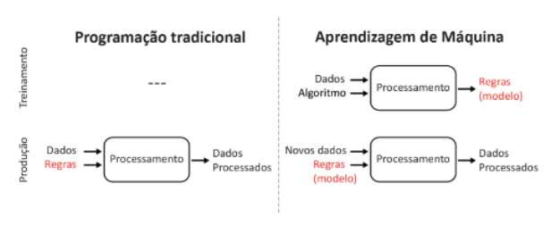

<h1 style="color: #ab0746; font-weight: bold; text-align: center">Aprendizado de Máquina</h1> 

<!-- fazer a descrição PAS desse problema -->

 Aprendizado de Máquina, subconjunto da IA,  envolve a capacidade de computadores de interpretar grandes volumes de dados, construir modelos baseados nesses dados e, assim, gerar hipóteses ou previsões sobre o mundo ao seu redor (Russel, 2016). Tradicionalmente, os computadores seguem rigorosamente as regras criadas pelos desenvolvedores, entretanto os avanços da indústria 4.0 os permitiu executar ações sem o passo a passo definido (Ris-Ala, 2023). Esses modelos atuam como uma "hipótese digital" sobre o comportamento dos dados, permitindo que o sistema resolva problemas ou tome decisões de forma automatizada (Russel, 2016). Ele pode ser de três tipos: supervisionada, não supervisionada e por reforço. 

 No aprendizado supervisionado, a máquina aprende por meio de exemplos rotulados. Isso significa que o algoritmo recebe um conjunto de dados conhecidos, onde cada dado inclui tanto as entradas quanto as saídas esperadas, e o objetivo do modelo é encontrar uma forma de correlacionar essas entradas com as saídas desejadas (Russel, 2016). Durante o treinamento, o algoritmo reconhece padrões nos dados, ajusta-se com base nas observações e aprimora suas previsões, enquanto o operador corrige eventuais erros. Esse ciclo de ajustes continua até que o modelo alcance um nível satisfatório de precisão e desempenho (Trask, 2019). 

 No aprendizado não supervisionado, o algoritmo de Machine Learning analisa os dados, explora hipóteses de correlações e relacionamentos entre eles para identificar padrões (Russel, 2016). Diferente do aprendizado supervisionado, aqui só as entradas são fornecidas, pois o objetivo é descobrir a estrutura subjacente dos dados. O algoritmo tenta agrupar os dados com base em características comuns, em um processo conhecido como clustering (Trask, 2019). Essa abordagem é vantajosa, pois permite identificar padrões desconhecidos nos dados. 

 O aprendizado por reforço possibilita que um sistema descubra o comportamento ideal através de interações de tentativa e erro com o ambiente. O sistema explora diferentes estratégias e recebe feedback com base nos resultados das escolhas feitas (Ris-Ala, 2023). Esse método imita o processo de aprendizado do cérebro humano. Nesse tipo de aprendizado, não existe um conjunto de dados pré-definido, pois a máquina precisa interagir com o ambiente para coletar as informações necessárias (Ris-Ala, 2023). 

 Assim, todas as abordagens de aprendizado compartilham a habilidade de adquirir conhecimento por meio do reconhecimento de padrões. 

