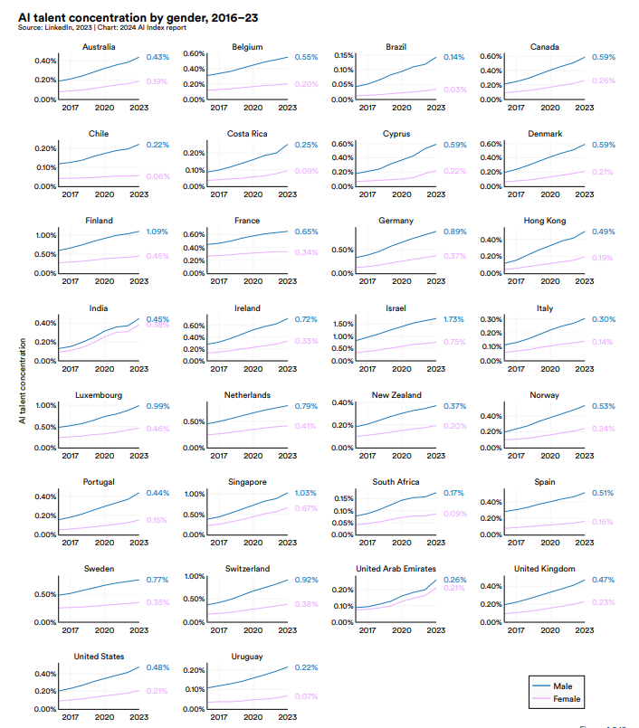
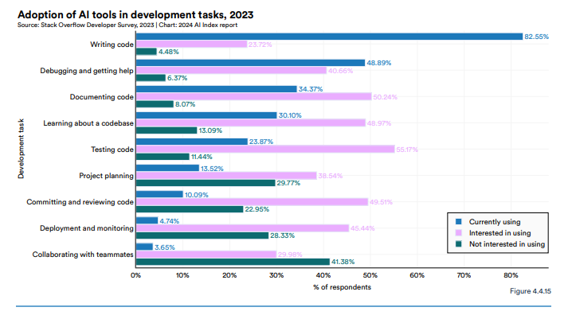

<h1 style="color: #070743; font-weight: bold; text-align: center">AI Index Report</h1> 

O <b>AI Index</b> é um relatório anual que fornece uma visão abrangente sobre o progresso da inteligência artificial (IA) com base em diferentes áreas, como pesquisa, mercado, educação e desempenho tecnológico. Seu objetivo é fornecer dados imparciais, rigorosamente verificados e com fontes amplamente diversificadas, para que policymakers, pesquisadores, executivos, jornalistas e o público geral possam desenvolver uma compreensão mais profunda e detalhada do campo complexo da IA. Este relatório é reconhecido globalmente como uma das fontes mais credíveis e autoritativas para dados e insights sobre a inteligência artificial (Stanford, 2024).

Porém, esses avanços também trazem desafios, particularmente os <b>desafios éticos</b> envolvidos no uso da IA. A privacidade de dados, o viés algorítmico e a transparência dos sistemas de IA são questões centrais discutidas no relatório e <a href="/modulo1/limitacoes">no tópico limitações, riscos e ética</a>.(Stanford, 2024).

A <b>diversidade de gênero</b>  na IA continua sendo um desafio, com as mulheres representando apenas 20% dos profissionais, enquanto os homens são 80% (AI Index relatórios 2018-2019). No entanto, há iniciativas para aumentar a inclusão feminina, como programas de mentoria e bolsas de estudo. A participação feminina em conferências como o NeurIPS cresceu mais de 800% desde 2012, mostrando uma evolução positiva, mas o ambiente ainda é predominantemente masculino, o que dificulta uma inclusão plena (Stanford, 2024).

Um os tópicos abordados no Index AI 2024 foi <b>The data is in: AI makes workers more productive and leads to higher quality work </b>, podendo ser encontrado no capítulo 4. 

A utilização de ferramentas de IA por desenvolvedores de software está crescendo rapidamente, com 56% dos entrevistados no levantamento anual do Stack Overflow de 2023 reportando o uso do GitHub Copilot. Quanto à integração de IA nos fluxos de trabalho dos desenvolvedores, 82,6% utilizam IA para escrita de código, 48,9% para depuração e 34,4% para documentação. A adoção de IA para testes de código, embora em 23,9% dos casos, tem 55,2% de interesse futuro.

De acordo com os desenvolvedores, a principal vantagem da IA é o aumento da produtividade (32,8%), seguida por aprendizado acelerado (25,2%) e eficiência aprimorada (25,0%). Uma grande maioria dos desenvolvedores tem uma visão positiva das ferramentas de IA, com 27,7% tendo uma opinião muito favorável e 48,4% favorável. Por exemplo, o uso do Copilot reduziu o tempo de execução de tarefas de 26% a 73% em comparação com desenvolvedores sem IA. A produtividade aumentou em 12,2%, a velocidade em 25,1% e a qualidade em 40% para consultores que utilizaram o GPT-4, comparado a um grupo de controle sem acesso à IA.

Além disso, a IA pode reduzir a disparidade de desempenho entre trabalhadores de diferentes habilidades, com trabalhadores menos qualificados mostrando um aumento de 43% no desempenho após o uso de IA, enquanto trabalhadores mais qualificados apresentaram um aumento de 16,5%.

<h1 style="color: #070743; font-weight: bold; text-align: center">Conclusão</h1> 

Com base nas informações apresentadas, fica claro que a IA tem se consolidado como uma ferramenta muito boa para aumentar a produtividade e a qualidade do trabalho, especialmente no contexto dos desenvolvedores de software. O uso de ferramentas como o GitHub Copilot tem mostrado uma redução significativa no tempo de execução de tarefas e um aumento notável na eficiência. Além disso, a IA está cada vez mais integrada aos fluxos de trabalho dos desenvolvedores, não só para a escrita de código, mas também para depuração, documentação e, em breve, até mesmo para testes de código. 

 

No entanto, acredito que é importante refletirmos sobre os impactos a longo prazo dessa crescente dependência da IA, especialmente para desenvolvedores menos qualificados. Embora a IA seja uma excelente ferramenta para acelerar o processo de aprendizado e desenvolvimento, o uso excessivo pode reduzir a capacidade desses profissionais em buscar soluções por conta própria e em desenvolver um pensamento crítico. A IA pode fornecer respostas rápidas, mas será que ela está ajudando essas pessoas a se tornarem profissionais mais completos no futuro? É possível que, ao se apoiar tanto nas ferramentas de IA, elas não desenvolvam a mesma autonomia e as habilidades essenciais que os profissionais mais experientes possuem atualmente? 

No curto prazo, ela pode proporcionar uma aceleração no aprendizado e uma melhoria nas entregas, mas no longo prazo, o verdadeiro desenvolvimento de um profissional não deve depender apenas da tecnologia. Os profissionais mais qualificados hoje provavelmente alcançaram um nível de experiência que vem com a prática constante, a resolução de problemas e o desenvolvimento de habilidades críticas. Se os desenvolvedores mais novos, que utilizam IA, não praticarem essas habilidades, existe o risco de que, no futuro, sua capacidade de resolução de problemas complexos e de adaptação a novos desafios seja limitada.

Portanto, é importante encontrar um equilíbrio entre aproveitar os benefícios da IA para aumentar a produtividade e garantir que as novas gerações de desenvolvedores sigam aprimorando suas habilidades de resolução de problemas e pensamento crítico. 

