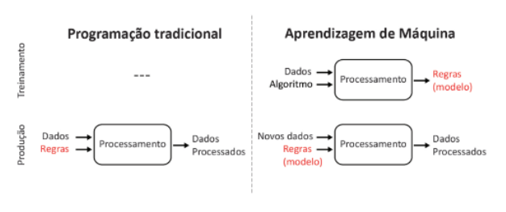

<h1 style="color: #070743; font-weight: bold; text-align: center">Inteligência Artificial</h1> 

 Com a chegada dos computadores modernos após a Segunda Guerra Mundial, abriu-se a possibilidade de desenvolver programas capazes de executar tarefas acadêmicas complexas. Esse avanço, aliado a novas descobertas na área da neurociência, levou cientistas a considerar a criação de um "cérebro eletrônico", ideia que eventualmente se transformaria no conceito de inteligência artificial (Jeffery, 2022). A IA pode ser entendida de diferentes maneiras, incluindo agir como humanos, pensar como humanos, pensar racionalmente e agir racionalmente. Essas abordagens variam desde a imitação do comportamento humano no Teste de Turing até a construção de agentes autônomos que buscam os melhores resultados esperados (Soares, 2024). Não existe, ainda, uma definição  única e amplamente aceita do que seria Inteligência Artificial (Sheikh, 2023). Pode-se dizer que  IA significa a imitação por computadores da inteligência inerente aos humanos (Sheikh, 2023), ou seja, elas não são apenas programadas para executar tarefas, mas sim para simular habilidades humanas, como o pensamento e o raciocínio. Essa definição, no entanto, é ampla e possui limitações, já que explica somente o termo “inteligência artificial” em outras palavras. 

 As origens da IA também podem ser encontradas em mitos e histórias de ficção científica. Desde o gigante de bronze Talos, na mitologia grega, até o robô Maria no filme "Metropolis" (1927), a ideia de criar máquinas que simulam características humanas tem fascinado a humanidade. Obras como "Frankenstein" (1818), de Mary Shelley, exploraram a criação artificial de vida, enquanto o ensaio "Darwin entre as Máquinas" (1863), de Samuel Butler, especulou que as máquinas poderiam evoluir e superar os humanos (Soares, 2024)

 Em 1997, Garry Kasparov, o campeão mundial de xadrez, jogou este jogo contra o Deep Blue, um computador desenvolvido pela empresa IBM, e foi derrotado, marcando, naquele ano, o avanço da inteligência artificial e a superação da “última resistência do cérebro” (Sheikh, 2023). Na época, acreditava-se que o xadrez representava o ápice da inteligência humana, e a vitória do Deep Blue gerou a expectativa de que os computadores poderiam superar os humanos em atividades consideradas mais simples do que o xadrez (Sheikh, 2023). No entanto, o xadrez  é um problema matemático com regras muito claras e um conjunto finito de alternativas, o que não o torna muito diferente de uma calculadora de bolso, que também pode fazer coisas muito difíceis até para pessoas muito inteligente. Mas isso não torna a calculadora uma forma artificial de inteligência humana. As dificuldades em definir IA não são, portanto, o resultado de alguma deficiência ou descuido, mas surgem do fato de que fomos incapazes de determinar precisamente qual inteligência desejaríamos replicar artificialmente. Dessa forma, definimos a Inteligência Artificial como sistemas que exibem comportamento inteligente ao analisar seu ambiente e tomar ações – com algum grau de autonomia – para atingir objetivos específicos. (Sheikh, 2023)

 Os avanços da IA ao longo do tempo foram marcados por períodos de progresso e estagnação. Nos primeiros passos, entre 1943 e 1956, surgiram os modelos neurais de Warren McCulloch e Walter Pitts e o Teste de Turing, de Alan Turing e durante o período de otimismo, de 1952 a 1969, ocorreram inovações como o aprendizado por reforço e o desenvolvimento dos perceptrons por Frank Rosenblatt (Soares, 2024). Porém, as limitações da IA levaram ao primeiro "inverno da IA" (1966-1973). Em seguida, os sistemas especialistas, prinicipalmemte na área da saúde com os diagnósticos médicos, marcaram um novo avanço (1969-1986), mas também enfrentaram desafios de manutenção (Soares, 2024).

 A inteligência artificial deu um grande avanço na década de 1980 com o retorno das redes neurais, em função de um algoritmo chamado retropropagação. Esse algoritmo basicamente ensina as redes neurais a aprenderem com os próprios erros, ajustando as conexões internas para melhorar os resultados. As redes baseadas nesse método, conhecidas como modelos conexionistas, se mostraram super eficazes e flexíveis. Esse período impulsionou a IA para a forma como ela é usada hoje, ajudando a criar as bases para tecnologias como reconhecimento de voz, tradução automática e as ferramentas conversacionais, como o ChatGPT e o Gemini.

<h1 style="color: #070743; font-weight: bold; text-align: center">Aprendizado de Máquina</h1> 

 Aprendizado de Máquina, subconjunto da IA,  envolve a capacidade de computadores de interpretar grandes volumes de dados, construir modelos baseados nesses dados e, assim, gerar hipóteses ou previsões sobre o mundo ao seu redor (Russel, 2016). Tradicionalmente, os computadores seguem rigorosamente as regras criadas pelos desenvolvedores, entretanto os avanços da indústria 4.0 os permitiu executar ações sem o passo a passo definido (Ris-Ala, 2023). Esses modelos atuam como uma "hipótese digital" sobre o comportamento dos dados, permitindo que o sistema resolva problemas ou tome decisões de forma automatizada (Russel, 2016). Nesse caso, a ML está sendo expandida para vários setores, como na medicina, a qual algoritmos podem ser treinados para reconhecer padrões genéticos em embriões e classificar o melhor embrião para implantação e, a partir disso, prever essas questões em novos embriões. Ele pode ser de três tipos: supervisionada, não supervisionada e por reforço. 

 O aprendizado supervisionado é uma das técnicas mais comuns e envolve o treinamento de algoritmos com um conjunto de dados rotulados. Isso significa que o algoritmo recebe um conjunto de dados de entrada e saída conhecidos, permitindo que ele aprenda a correlacionar as variáveis de entrada (inputs) com os resultados esperados (outputs) (Russell, 2016). O processo consiste em alimentar o algoritmo com esses dados rotulados, ajustar os parâmetros do modelo com base nas diferenças entre as previsões e os resultados reais, e repetir o ciclo até que o desempenho seja satisfatório e preciso (Trask, 2019). 

Uma das técnicas de aprendizado supervisionado é a classificação, que busca atribuir rótulos ou classes pré-definidas aos dados (Google, 2024). Isso é feito com um modelo treinado com um conjunto de dados que possuem as entradas e as respectivas classes conhecidas, assim o algoritmo aprende a identificar padrões ou características que diferenciam essas classes (Google, 2024). No contexto da medicina reprodutiva, treinado com um conjunto de dados rotulados, como euploides e aneuploides, o aprendizado supervisionado com algoritmo de classificação aprende a reconhecer características comum desses dados e, em seguida, consegue prever a probabilidade de um novo embrião estar em alguma dessas categorias.

 De maneira geral, um algoritmo de aprendizado supervisionado separa o banco de dados, seja de forma aleatória ou pré-definida, em três subconjuntos: treinamento, validação e testes (Google, 2024). Na primeira etapa, chamada de fase de treinamento, o algoritmo é ajustado para identificar padrões nos dados de entrada e associá-los às classes desejadas (Google, 2024). Em seguida, na fase de validação, utiliza-se outro subconjunto de dados, que não foi usado no treinamento, para avaliar o desempenho do modelo, comparando suas previsões com as respostas corretas (Google, 2024). Se os resultados não forem satisfatórios, os hiperparâmetros – parâmetros que orientam o processo de treinamento – devem ser ajustados, e o banco de dados é reorganizado e dividido novamente, repetindo-se as duas etapas iniciais (Google, 2024). Após obter um resultado satisfatório, aplica-se o conjunto de testes para mensurar métricas de acurácia, recall, precisão, entre outros, garantindo o desempenho esperado da IA (Google, 2024). 

 No aprendizado não supervisionado, o algoritmo de Machine Learning analisa os dados, explora hipóteses de correlações e relacionamentos entre eles para identificar padrões (Russel, 2016). Diferente do aprendizado supervisionado, aqui só as entradas são fornecidas, pois o objetivo é descobrir a estrutura subjacente dos dados. O algoritmo tenta agrupar os dados com base em características comuns, em um processo conhecido como clustering (Trask, 2019). Essa abordagem é vantajosa, pois permite identificar padrões desconhecidos nos dados. 

 O aprendizado por reforço possibilita que um sistema descubra o comportamento ideal através de interações de tentativa e erro com o ambiente. O sistema explora diferentes estratégias e recebe feedback com base nos resultados das escolhas feitas (Ris-Ala, 2023). Esse método imita o processo de aprendizado do cérebro humano. Nesse tipo de aprendizado, não existe um conjunto de dados pré-definido, pois a máquina precisa interagir com o ambiente para coletar as informações necessárias (Ris-Ala, 2023). 

 Assim, todas as abordagens de aprendizado compartilham a habilidade de adquirir conhecimento por meio do reconhecimento de padrões. 

 

<h1 style="color: #070743; font-weight: bold; text-align: center">Redes Neurais</h1> 

De acordo com Fleck et al. (2016, p. 50), uma rede neural é um sistema projetado para modelar a maneira como o cérebro realiza uma tarefa particular, sendo normalmente implementada utilizando-se componentes eletrônicos ou é simulada por propagação em um computador digital. Para alcançarem bom desempenho, as redes neurais empregam uma interligação maciça de células computacionais simples, denominadas de “neurônios” ou unidades de processamento 

matemático do neurônio biológico desenvolvido por Warren McCulloch e Walter Pitts em 1943 (Gomes, 2010). Esse modelo, conhecido como neurônio MCP (McCulloch-Pitts), consiste em um conjunto de entradas, que são multiplicadas por pesos específicos. O resultado dessas multiplicações é somado e, posteriormente, comparado a um valor de limiar para determinar a resposta do sistema (Fleck, 2016).

As Redes Neurais Artificiais (RNAs) são frequentemente aplicadas na solução de problemas complexos, especialmente quando o comportamento das variáveis não é completamente compreendido. Uma de suas principais características é a habilidade de aprender com base em exemplos, além de generalizar o conhecimento adquirido. Isso resulta na criação de um modelo não linear, o que torna sua utilização na análise espacial altamente eficaz.

<b> Exemplo de uso </b>

O uso de Redes Neurais Artificiais (RNAs) na análise da ploidia de embriões humanos se mostra promissor, principalmente devido à sua capacidade de aprender e generalizar a partir de grandes volumes de dados complexos. No contexto da reprodução assistida, a identificação precisa de embriões euploides e aneuploides é essencial para o sucesso das técnicas de fertilização in vitro, pois a presença de aneuploidias pode resultar em falhas de implantação e abortos espontâneos (Sousa, 2022). A escolha das RNAs para essa tarefa é justificada pela sua habilidade em lidar com variáveis de alta dimensionalidade e por sua capacidade de aprender padrões não lineares, que são típicos em dados biológicos e morfológicos (Sousa, 2022).

Neste estudo, foi desenvolvida uma rede neural artificial adaptada para prever a ploidia dos embriões. A escolha das RNAs como ferramenta para essa análise foi motivada por sua eficácia em integrar diferentes tipos de dados e pela possibilidade de criar um modelo preditivo robusto (Sousa, 2022).

<h1 style="color: #070743; font-weight: bold; text-align: center">Big Data</h1>

Big Data refere-se a grandes volumes de dados que são gerados a partir de diversas fontes, como redes sociais, sensores, dispositivos móveis e transações online (Russell, 2016). Esses dados são caracterizados pelas chamadas "3 Vs": <b>volume</b> (quantidade imensa de informações), <b>velocidade</b> (a rapidez com que são gerados e processados) e <b>variedade</b> (a diversidade de formatos, como texto, imagens e vídeos) (Camargo-Vega, 2015). O crescimento desses dados impulsionou o desenvolvimento de algoritmos de aprendizado para lidar com grandes volumes de informação, muitas vezes não rotulada. Por exemplo, no caso da desambiguação de palavras, como "planta", que pode se referir a uma planta ou uma fábrica. Com volumes massivos de dados, algoritmos adequados conseguem alcançar alta precisão (Russell, 2016).

<b>Vantagens do Big Data segundo os autores de Conociendo Big Data:</b>
<ul>
  <li><b>Melhoria na tomada de decisões:</b> Com ferramentas analíticas, organizações podem identificar padrões e insights para decisões mais embasadas.</li>
  <li><b>Automação de processos:</b> Big Data permite o uso de algoritmos que realizam tarefas em tempo real, como recomendação de produtos.</li>
  <li><b>Otimização de estratégias de negócios:</b> Dados detalhados ajudam a personalizar produtos e campanhas, aumentando a eficiência.</li>
  <li><b>Inovação tecnológica:</b> Áreas como IA e aprendizado de máquina evoluíram com o suporte de Big Data, aprimorando aplicações em saúde, transporte e segurança.</li>
</ul>

<b>Desvantagens do Big Data segundo os autores de Conociendo Big Data:</b>
<ul>
  <li><b>Falta de profissionais qualificados:</b> Muitas organizações enfrentam dificuldades para encontrar especialistas em análise de dados.</li>
  <li><b>Complexidade técnica:</b> Projetar arquiteturas para sistemas de Big Data pode ser desafiador e caro.</li>
  <li><b>Problemas de privacidade:</b> Coletar e armazenar grandes volumes de dados pessoais pode gerar questões éticas e legais.</li>
  <li><b>Custo elevado de implementação:</b> Ferramentas e infraestrutura para Big Data exigem investimentos substanciais.</li>
  <li><b>Velocidade e escalabilidade:</b> Sistemas podem enfrentar limitações para processar consultas em tempo real ou para expandir de forma eficiente.</li>
</ul>

<h1 style="color: #070743;; font-weight: bold; text-align: center">Aprendizado Profundo</h1>

Deep Learning, ou aprendizado profundo, é uma subárea do aprendizado de máquina que utiliza redes neurais compostas por várias camadas de processamento para aprender representações de dados em diferentes níveis de abstração (Russell, 2016). Essa abordagem permite lidar com dados complexos, como imagens, áudios e textos, sem a necessidade de intervenção manual para extrair características relevantes (Russell, 2016). 

As técnicas convencionais de aprendizado de máquina apresentavam limitações ao processar dados naturais em sua forma bruta (LeCun, 2015). Deep Learning surgiu para superar essas limitações, substituindo a engenharia manual por redes neurais treináveis que extraem automaticamente características relevantes diretamente dos dados, utilizando camadas profundas de processamento (LeCun, 2015).

<b>Tipos de Deep Learning segundo LeCun:</b>
<ul>
  <li>Aprendizado Supervisionado</li>
  <li>Convolutional Neural Networks (CNNs): Redes especializadas no processamento de dados em formatos de múltiplos arrays, como imagens</li>
  <li>Aprendizado Não Supervisionado</li>
  <li>Recurrent Neural Networks (RNNs): Redes projetadas para processar sequências de dados, como texto ou séries temporais. Possuem conexões recorrentes que permitem "memória" de estados anteriores. Aplicações incluem tradução automática e análise de sentimentos. </li>

Apesar do sucesso do aprendizado profundo, sua aplicação enfrenta algumas limitações. A <b>necessidade de hardware avançado</b> representa um desafio, pois redes profundas demandam grande capacidade computacional para processar as operações necessárias durante o treinamento. Além disso, a <b>dependência de grandes volumes de dados</b> é uma restrição importante, já que o desempenho de modelos de deep learning está diretamente relacionado à quantidade e à qualidade dos dados disponíveis. Por último, o uso de <b>algoritmos sofisticados</b> também pode ser um obstáculo, pois exige estratégias avançadas para lidar com problemas como overfitting e instabilidade no treinamento, tornando o desenvolvimento e a implementação de redes profundas mais complexos e menos acessíveis. (LeCun, 2015)

