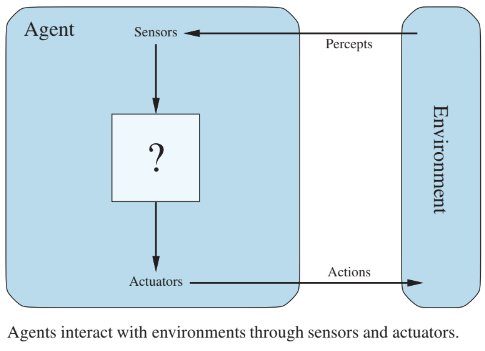

<h1 style="color: #070743; font-weight: bold; text-align: center">Agentes Inteligentes</h1> 

Um agente de inteligência artificial (IA) é um programa de software que pode interagir com seu ambiente, coletar dados e usar os dados para realizar tarefas autodeterminadas para atingir metas predeterminadas (AWS, 2024). Esses agentes podem ser físicos, como um robô, ou virtuais, como um software. No caso de um agente de IA, ele utiliza os dados coletados para realizar tarefas de forma autônoma e tomar decisões informadas com base em seu conhecimento e nas suas percepções (Russell, 2010). Por exemplo, um carro autônomo é um agente inteligente que utiliza sensores para perceber obstáculos na estrada e agir para evitá-los.

O termo "percepto" é usado para descrever os dados que os sensores de um agente captam do ambiente. Já a sequência de percepção de um agente representa o histórico completo de tudo o que ele registrou até o momento (Russell, 2010). 

<h3 style="color: #070743; font-weight: bold; text-align: center">Componentes da arquitetura de agentes</h3> 

<b>Arquitetura do Agente</b>

A arquitetura de um agente é a base que permite sua operação e interação com o ambiente. Ela pode ser tanto física quanto digital, dependendo do tipo de agente em questão (Russell, 2010). Cada tipo de agente requer uma arquitetura personalizada, adaptada às suas necessidades de interação com o ambiente e à execução de suas tarefas específicas. A escolha da arquitetura é crucial para o sucesso do agente, pois ela determina como ele será capaz de perceber seu ambiente e agir sobre ele para atingir seus objetivos (AWS, 2024). 

<b>Função do Agente</b>

A função de um agente é a lógica que conecta as percepções recebidas pelo agente com as ações que ele deve realizar para alcançar seus objetivos (AWS, 2024). Em outras palavras, é a tradução dos dados coletados pelo agente em ações práticas que o movem em direção à sua meta (AWS, 2024). A eficiência e eficácia do agente dependem diretamente de uma função bem projetada, que permita que o agente se adapte e tome decisões apropriadas com base nas percepções e nas mudanças em seu ambiente (Russell, 2010).

<b>Programa do Agente</b>

O programa do agente é a implementação concreta da função do agente dentro de sua arquitetura (AWS, 2024). Trata-se do código de software que executa as ações do agente de acordo com a lógica estabelecida em sua função (AWS, 2024).  O desenvolvimento do programa de agente envolve a criação, treinamento e implantação do sistema, garantindo que ele possa operar de forma autônoma e eficiente (Russell, 2010). Durante o processo de implementação, o programa de agente deve ser capaz de processar entradas, tomar decisões baseadas nas percepções e executar ações que o aproximem de seu objetivo. Esse programa integra a lógica de negócios, os requisitos técnicos e os elementos de performance do agente, sendo essencial para garantir que o agente funcione corretamente dentro do contexto para o qual foi projetado (Russell, 2010).

<h3 style="color: #070743; font-weight: bold; text-align: center">Descrição PEAS</h3> 

A descrição PEAS (Performance, Environment, Actuators, Sensors) é um modelo usado para especificar o ambiente de tarefas de um agente (Russell, 2010). Ela envolve quatro componentes principais:

<ul>
<li> <b>Medida de Performance:</b> Define os objetivos do agente e como seu desempenho será avaliado. Por exemplo, no caso de um taxista automatizado, isso poderia incluir alcançar o destino correto, minimizar o consumo de combustível e o tempo de viagem, ou garantir a segurança dos passageiros. </li>

<li> <b>Ambiente:</b> Refere-se ao mundo onde o agente opera e interage. Para um taxista automatizado, isso inclui diferentes tipos de vias, tráfego, pedestres e outros obstáculos que o agente precisa gerenciar. </li>

<li> <b>Atuadores:</b> São os mecanismos através dos quais o agente realiza ações no ambiente, como os motores de um carro ou os controles de um jogo. </li>

<li> <b>Sensores:</b> Permitem que o agente perceba seu ambiente, como câmeras ou sensores de movimento em um carro ou sensores de posição no jogo. </li>
</ul>

<h3 style="color: #070743; font-weight: bold; text-align: center">Propriedades do Ambiente de Tarefas</h3> 

Segundo Ressull, as propriedades do ambiente podem ser divididas em:

<ul>
  <li><strong>Ambiente Totalmente Observável vs. Parcialmente Observável:</strong> Em um ambiente totalmente observável, o agente tem acesso a todas as informações necessárias para tomar decisões, sem precisar adivinhar ou inferir nada, ou seja, o agente sabe exatamente o que está acontecendo em cada momento.Já em um ambiente parcialmente observável, o agente não tem acesso a todas as informações e precisa fazer suposições ou usar estratégias para preencher as lacunas. Isso acontece quando o agente tem uma visão limitada do ambiente </li>
  
  <li><strong>Ambiente de Agente Único vs. Multiagente:</strong> Um ambiente de agente único envolve apenas um agente que interage com o ambiente, sem considerar outras entidades como participantes ativos.Em ambientes multiagente, múltiplos agentes interagem, o que pode incluir situações cooperativas ou competitivas. </li>
  
  <li><strong>Ambiente Determinístico vs. Nondeterminístico:</strong> Em um ambiente determinístico, o estado futuro do ambiente é totalmente previsível a partir do estado atual e das ações tomadas. Já os ambientes nondeterminísticos apresentam incerteza sobre o impacto das ações, tornando difícil prever o estado futuro.</li>
  
  <li><strong>Ambiente Episódico vs. Sequencial:</strong> Ambientes episódicos se caracterizam por tarefas em que as decisões tomadas em uma fase não afetam as decisões ou o resultado de fases subsequentes. Em ambientes sequenciais, as decisões em um momento afetam o futuro.</li>
  
  <li><strong>Ambiente Estático vs. Dinâmico:</strong> Em um ambiente estático, nada muda enquanto o agente está decidindo o que fazer. Ou seja, o ambiente permanece igual durante o tempo em que o agente pensa ou age. Já em um ambiente dinâmico, o ambiente muda enquanto o agente ainda está pensando ou tomando decisões. Isso significa que o agente precisa agir rapidamente porque o que está acontecendo ao seu redor pode mudar.</li>

  <li><strong>Ambiente Discreto vs. Contínuo:</strong> Ambientes discretos têm um número finito de estados possíveis, e as ações podem ser contadas e definidas claramente. Em ambientes contínuos, o estado do ambiente e as ações são representados por valores que podem variar de forma contínua</li>
  
  <li><strong>Ambiente Conhecido vs. Desconhecido:</strong> Em um ambiente conhecido, todos os aspectos do ambiente são bem compreendidos e o agente pode tomar decisões baseadas em um conjunto claro de regras. Em um ambiente desconhecido, o agente pode não ter informações completas ou precisas sobre como o ambiente funciona, necessitando de aprendizado ou experimentação para tomar boas decisões.</li>
</ul>

<h3 style="color: #070743; font-weight: bold; text-align: center">Exemplo - Sensor de Cadeira de Rodas</h3> 

| **Componente**      | **Descrição**                                                                                                 |
|---------------------|---------------------------------------------------------------------------------------------------------------|
| **Medida de Desempenho** | **Precisão na detecção de obstáculos:** Minimizar o número de colisões ou acidentes com obstáculos.   **Eficiência na navegação:** Maximizar a capacidade de a cadeira de rodas se mover sem interrupções ou contratempos.   **Tempo de resposta:** Reduzir o tempo entre a detecção de um obstáculo e a ação corretiva.   **Adaptabilidade:** Ajustar a reação do sensor a diferentes tipos de obstáculos e ambientes. |
| **Ambiente**        | **Superfície onde a cadeira de rodas se move:** Calçadas, rampas, ruas, etc.   **Obstáculos no caminho:** Móveis, portas, buracos, obstáculos baixos como fios ou objetos caídos.   **Condições do ambiente:** Iluminação, espaço disponível para manobra, presença de outros indivíduos.   **Sensores de proximidade:** Para detectar obstáculos nas rotas possíveis. |
| **Atuadores**       | **Sistemas de alerta:** Sons ou luzes que alertam o usuário sobre a presença de obstáculos.   **Motor de controle da cadeira:** Ajusta a direção ou a velocidade da cadeira em resposta ao feedback do sensor.   **Freio automático:** O sistema pode automaticamente parar a cadeira para evitar colisões. |
| **Sensores**        | **Sensores de proximidade:** Detectam obstáculos próximos à cadeira de rodas (por exemplo, sensores ultrassônicos ou infravermelhos).   **Sensores de inclinação:** Detectam se a cadeira de rodas está em uma posição instável ou inclinada, ajustando automaticamente a orientação.   **Sensores de movimento:** Detectam o movimento da cadeira e ajustam os comandos com base na velocidade ou direção.   **Sensores de pressão:** Verificam a presença de obstáculos que não são detectados visualmente, como fios no chão. |

| **Propriedade**                      | **Justificativa**                                                                                                                                                                                                                                                                                                                   |
|--------------------------------------|--------------------------------------------------------------------------------------------------------------------------------------------------------------------------------------------------------------------------------------------------------------------------------------------------------------------------------------|
| **Completamente observável**         | O sensor de cadeira de rodas precisa captar todos os elementos relevantes ao seu redor (obstáculos e outros fatores ambientais) para garantir segurança e precisão. Isso é essencial para evitar colisões e garantir que o agente esteja ciente de todas as condições ao seu redor.                                        |
| **Agente único**                     | A cadeira de rodas é um agente único, agindo individualmente para atingir seus objetivos, como evitar obstáculos e mover-se de maneira eficiente. Não há outros agentes competindo ou interagindo diretamente com a cadeira em seu ambiente imediato.                                                           |
| **Não determinístico**               | O ambiente em que a cadeira de rodas opera pode ser imprevisível, com obstáculos inesperados e condições variáveis, como mudanças na superfície (buracos, pedras) ou tráfego de pessoas. Isso torna impossível prever com exatidão todos os fatores que podem afetar o movimento da cadeira.                                  |
| **Sequencial**                       | As ações da cadeira de rodas, como a alteração de direção ou a velocidade, afetam o estado futuro do ambiente, como a posição do agente e a interação com obstáculos. A cadeira de rodas precisa considerar como suas ações atuais influenciam os próximos estados do ambiente e as reações necessárias.                           |
| **Dinâmico**                          | O ambiente onde a cadeira de rodas opera está constantemente mudando. Obstáculos podem ser movidos, pessoas podem aparecer de repente, e as condições da superfície (como inclinação ou buracos) podem mudar. Isso exige que o agente se adapte em tempo real às mudanças que acontecem ao seu redor.                               |
| **Contínuo**                         | O movimento da cadeira de rodas ocorre de forma contínua. A cadeira não muda de estado de forma abrupta, mas sim de forma gradual, com variações constantes na direção e na velocidade, dependendo das percepções em tempo real do ambiente ao redor.                                                                                             |
| **Desconhecido**                     | Embora a cadeira de rodas tenha sensores para detectar obstáculos e outras condições ao seu redor, o ambiente pode ser parcialmente desconhecido, especialmente em relação a obstáculos temporários ou situações inesperadas. O sistema de navegação precisa aprender e adaptar-se a essas situações à medida que ocorrem.                |
