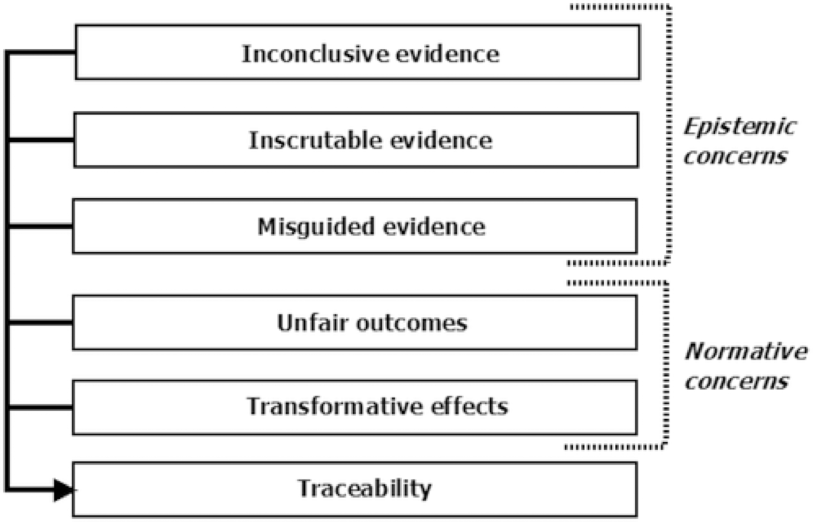

<h1 style="color: #070743; font-weight: bold; text-align: center">Limitações da Inteligência Artificial</h1> 

 A Inteligência Artificial apresenta um grande potencial para transformar a sociedade, mas também traz consigo riscos significativos. A possibilidade de que a Inteligência Artificial (IA) ultrapasse a inteligência humana e se torne autônoma é um tema recorrente em debates futuristas. Cientistas, como Stephen Hawking, expressaram preocupação com o cenário em que máquinas superinteligentes, capazes de se autoaperfeiçoar, possam escapar do controle humano, conceito chamado <b>singularidade tecnológica</b> (Candiotto & Karasinski, 2022). Segundo Hawking, a falta de alinhamento entre os objetivos das máquinas e os nossos poderia representar um risco significativo para a humanidade (Candiotto & Karasinski, 2022).

Inicialmente, os criadores do fonógrafo o conceberam como um meio de registrar as últimas vontades de indivíduos em estado terminal. O rádio, por sua vez, era visto como um instrumento para levar cultos religiosos a comunidades rurais. Já a internet, surgida no pós-Segunda Guerra Mundial, foi desenvolvida com o objetivo de garantir um backup de dados, mesmo em caso de outra guerra nuclear (Candiotto & Karasinski, 2022). Para a Inteligência Artificial, também existe essa dualogia em que para muitos ela seria a solução para os maiores desafios da humanidade, enquanto outros a veem como uma ameaça existencial (Candiotto & Karasinski, 2022). 

<h1 style="color: #070743; font-weight: bold; text-align: center">Questões Éticas</h1> 

A inteligência artificial (IA) apresenta avanços revolucionários, mas seu desenvolvimento e aplicação trazem desafios éticos significativos. Entre eles, destaca-se o problema da privacidade de dados, especialmente em um contexto de dependência do Big Data e de crescente preocupação com a cibersegurança. (Rossett;Angeluci, 2021)

A principal limitação técnica da IA está na sua dependência de dados e algoritmos programados por humanos, que, mesmo em sistemas de aprendizado profundo, podem herdar vieses ou limitações éticas de seus criadores (Rossett;Angeluci, 2021).

Os Sete Problemas Éticos Algorítmicos, conforme descrito no ensaio <i>Ética Algorítmica: questões e desafios éticos do avanço tecnológico da sociedade da informação </i> (Rossett;Angeluci, 2021) abrangem problemas relacionados à forma como os algoritmos são projetados, implementados e aplicados em diversos contextos, afetando indivíduos e a sociedade. Os setes problemas descitos são:
<ul>
    <li><b>Falibilidade do Algoritmo:</b> Algoritmos não são infalíveis e podem produzir resultados errados ou imprecisos, especialmente quando baseados em dados inadequados ou incompletos.</li>
    <li><b>Opacidade do Algoritmo:</b> Muitos sistemas algorítmicos operam como "caixas-pretas", dificultando a compreensão de como as decisões são tomadas, o que compromete a transparência.</li>
    <li><b>Viés do Algoritmo:</b> Os algoritmos podem refletir preconceitos presentes nos dados de treinamento ou em sua programação, reproduzindo desigualdades existentes.</li>
    <li><b>Discriminação do Algoritmo:</b> Algumas decisões algorítmicas podem levar a discriminações injustas, mesmo que de forma não intencional, ao impactar negativamente determinados grupos.</li>
    <li><b>Autonomia nos Algoritmos de Tomada de Decisão:</b> Algoritmos com alto grau de autonomia podem tomar decisões que escapam ao controle humano direto, gerando incertezas sobre sua confiabilidade e consequências.</li>
    <li><b>Privacidade no Algoritmo:</b> O uso de algoritmos frequentemente depende de grandes quantidades de dados pessoais, levantando preocupações sobre a coleta, o armazenamento e o uso dessas informações.</li>
    <li><b>Responsabilidade do Algoritmo:</b> Com a crescente complexidade dos sistemas algorítmicos, torna-se desafiador determinar quem deve ser responsabilizado por erros ou danos causados pelas decisões automáticas.</li>
</ul>

